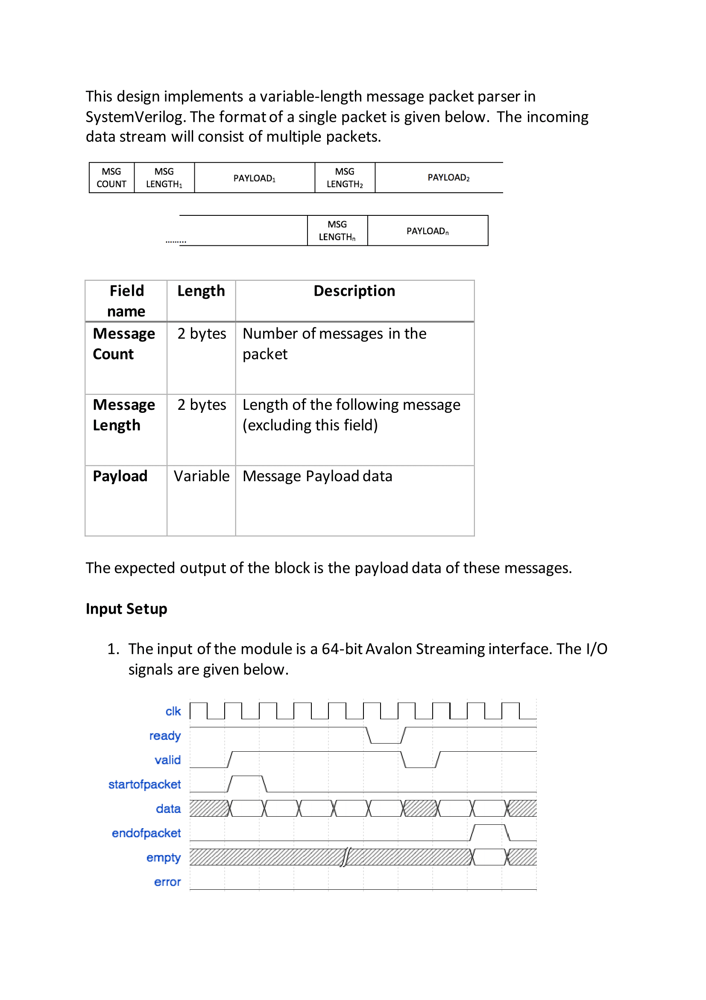
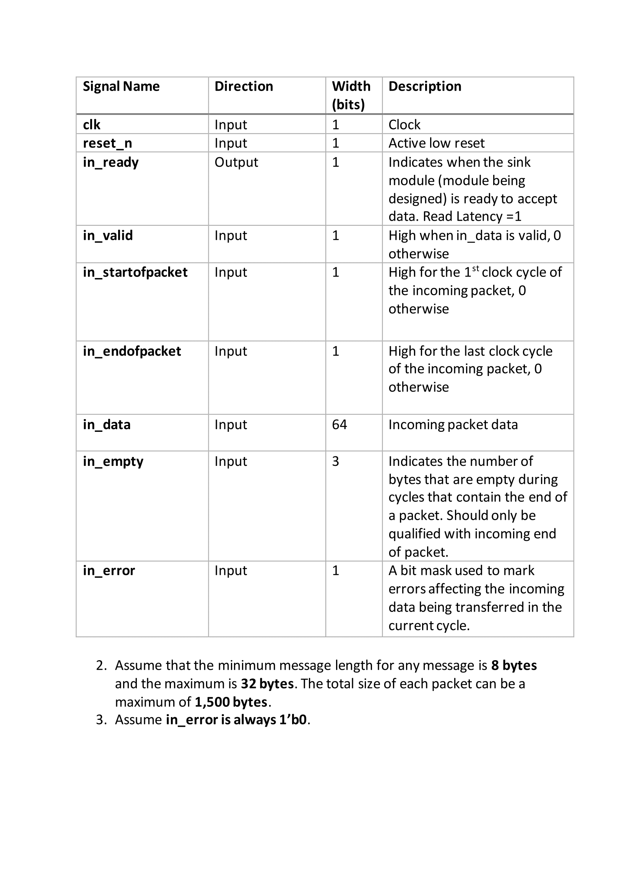

# Message Extractor






# How to run simulation and view waveforms

1. Download and install the free ModelSim-Intel FPGA Starter Edition: www.intel.com/content/www/us/en/software/programmable/quartus-prime/model-sim.html
2. Prepend ModelSim binary path to system `PATH` environment variable
3. Execute the following command to compile and run simulation:

    ```
    make sim \
        [MIN_MSG_BYTES=<min_msg_bytes>] \
        [MAX_MSG_BYTES=<max_msg_bytes>] \
        [WIDTH_IN_DATA_BYTES=<width_in_data_bytes>] \
        [RUN_BRINGUP_PKT=<1,0> | NUM_PKT=<num_pkt> NUM_MSG_PER_PKT=<num_msg_per_pkt>] \
        [IN_VALID_PROB=<in_valid_prob>] \
        [SEED=<seed>]
    ```

4. Execute the following command to view waves:

    ```
    make waves
    ```

5. Execute the following command to clean the directory:

    ```
    make clean
    ```
